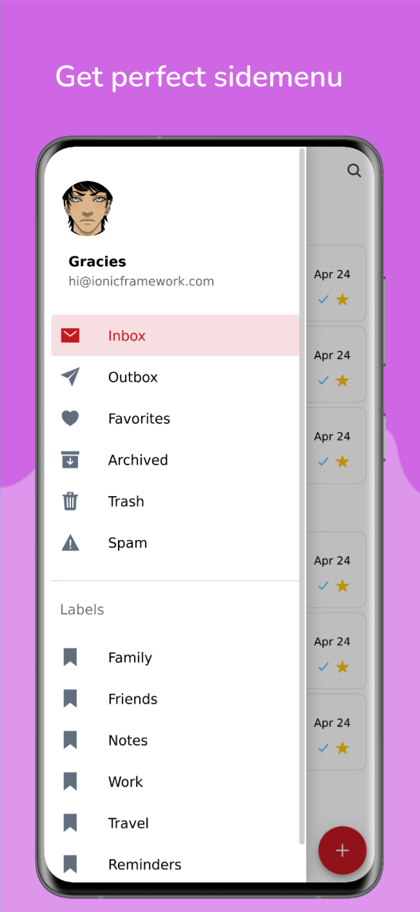
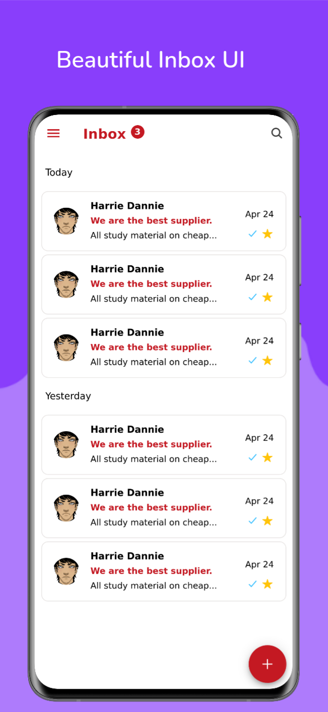
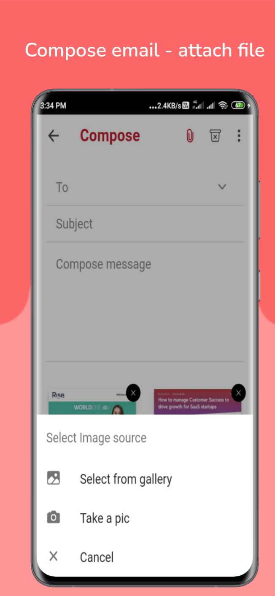
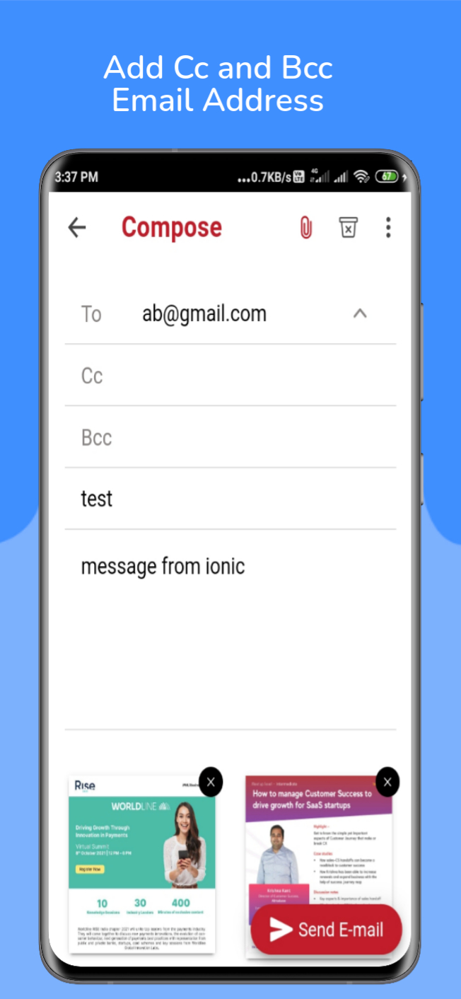
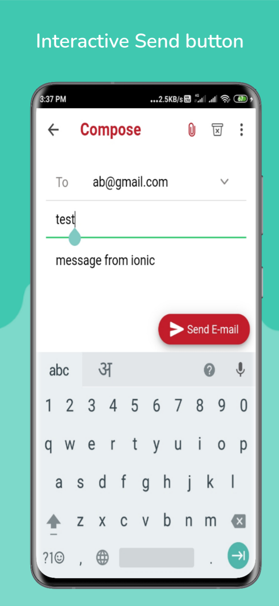

# Ionic-emails-app
This is simple ionic emails app with cordova email composer plugin, capacitor camera API. We can compose emails with this app and it will send the email via native email application of our device. 

We can also add the attachments from our gallery and camera by using capacitor camera API.

# Output

# Live Demo
[How to send ionic 5 emails?](https://sbsharma.com/compose-ionic-emails)

# Contributor
[Satpal Bhardwaj](https://sbsharma.com/ionic/)

# Follow us

