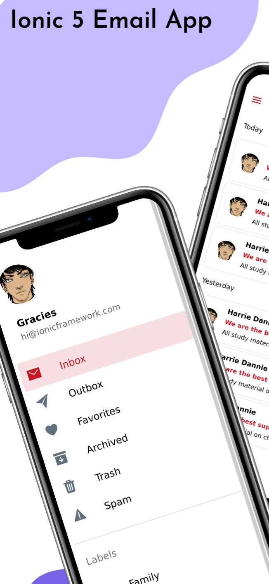
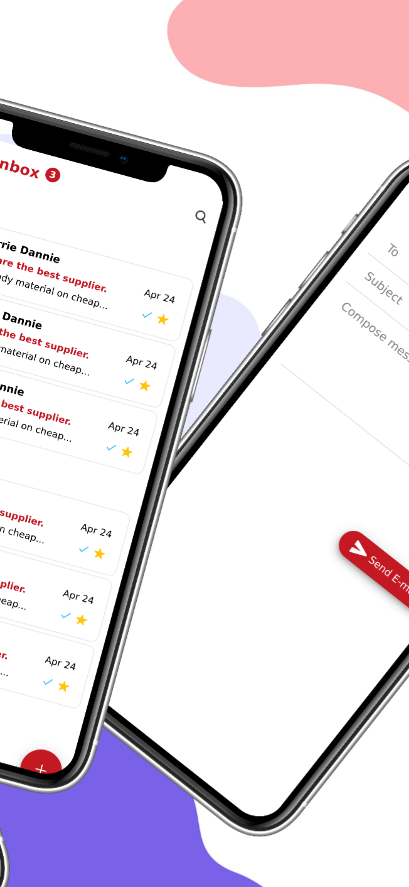
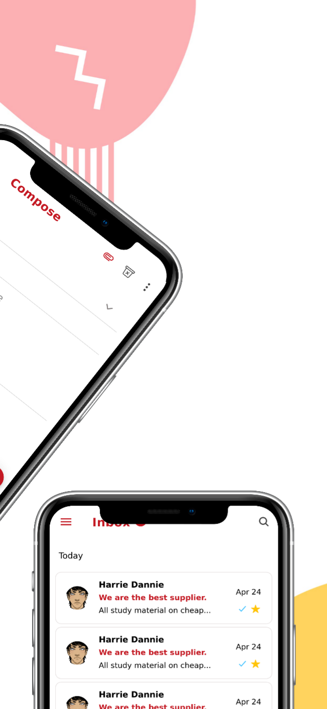

# Ionic-emails-app
This is simple ionic emails app with cordova email composer plugin, camera and native file plugin

# Output

# Live Demo
Blog article url will be here soon

# Contributor
[Satpal Bhardwaj](https://sbsharma.com/ionic/)

# Follow us

